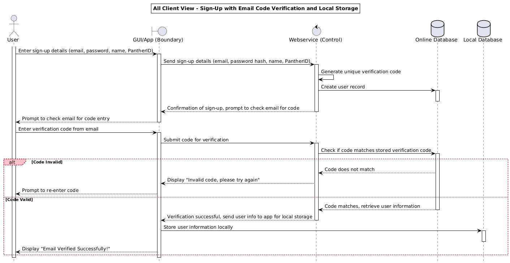
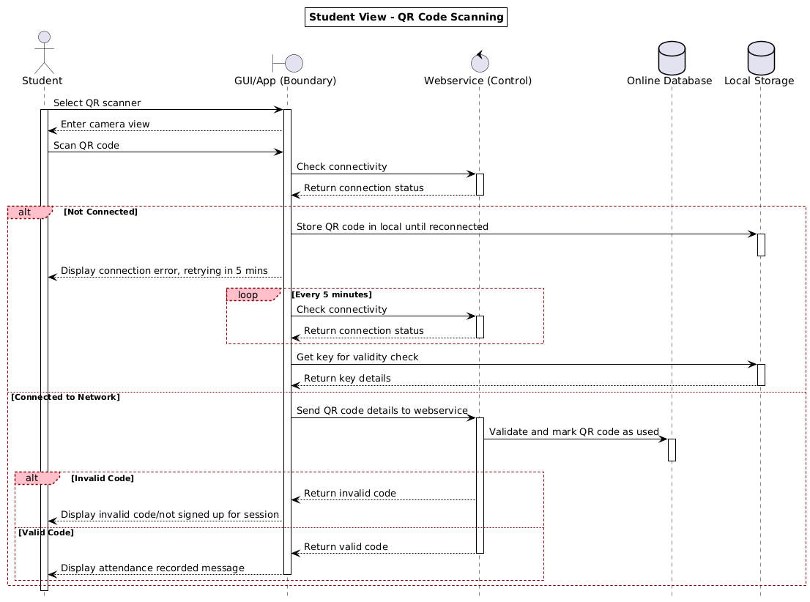
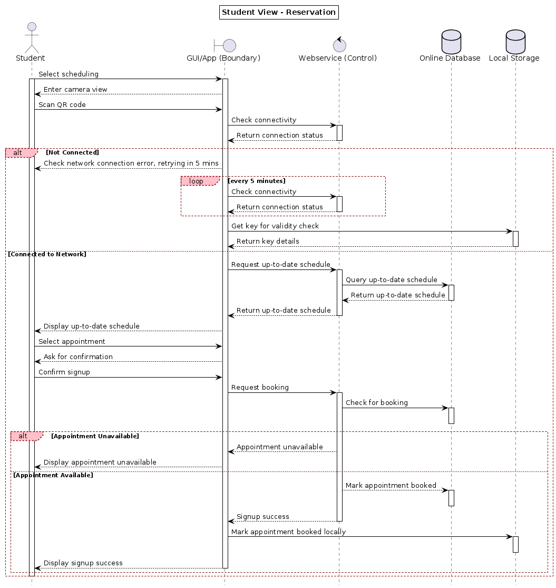
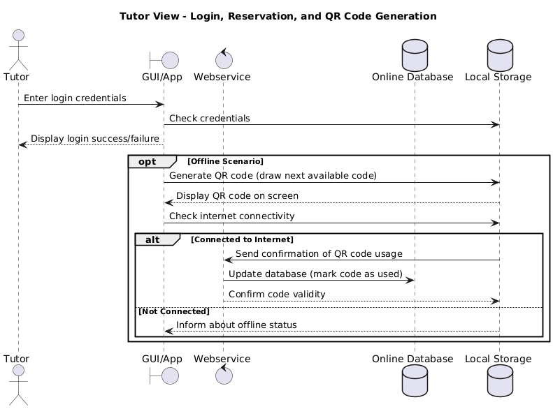
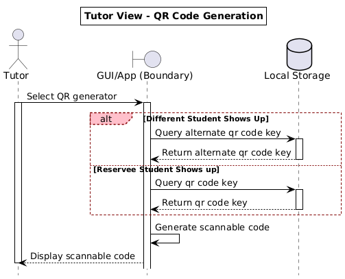
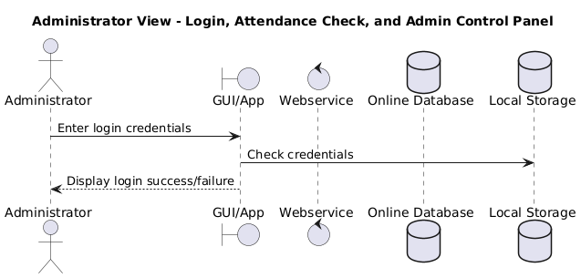

# Project Diagrams

## All Users

*Figure 1: User Authentication Diagram*
\newpage

## Student

*Figure 2: QR Scanning Diagram*

*Figure 3: Student Scheduling Appointment Diagram*
\newpage

## Tutor

*Figure 4: Tutor Schedule Hours Diagram*

*Figure 5: Tutor Generate QR Code Diagram*
\newpage

## Admin

*Figure 6: Admin Dashboard View Diagram*
